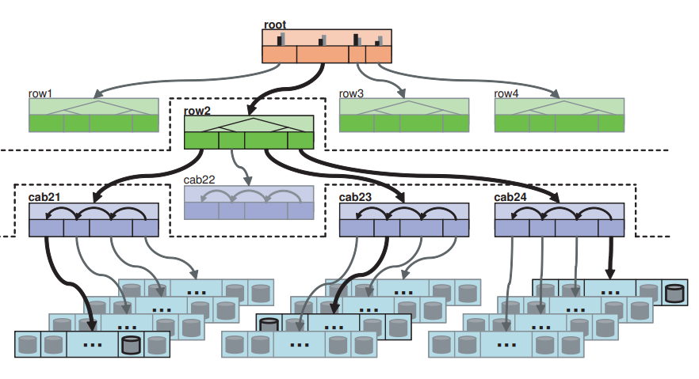

# Ceph 中的分片摆放算法 CRUSH

## 背景

在一些分布式系统中（如分布式缓存），我们常常使用一致性哈希[1]（如哈希环）来进行数据分片。集群中的任何一台机器、集群外的客户端机器，在具备**集群视图**（集群中所有机器的信息）的情况下，可以**确定性**地计算出任意数据对应的分片位置，不需要中心化的元数据节点介入。

在分布式存储系统中，情况有所不同。因为一个分片需要存在于若干个**副本**中，以保证机器错误时数据不丢失。为了避免相互关联的错误（如一整个机架断电）导致多副本丢失，各副本需要摆放在几个物理隔离的错误域（如不同机架、不同可用区）之中。一致性哈希中难以建模错误域，不能胜任分布式存储中分片的任务。

因此，在常见的分布式存储系统中，我们需要中心化的元数据节点，来负责分片的副本摆放。集群中的机器不再有能力自行计算分片位置，而需要向元数据节点查询。中心化的副本选取可能会导致一些可扩展性问题。

Ceph 是一个为消灭了中心化的元数据节点而设计的分布式存储系统，集群中的机器需要自行根据集群视图来计算出分片位置。Ceph 需要一个分片算法来代替一致性哈希，不丢失一致性哈希优点的同时，又加入错误域等存储需要的建模——这就是我们今天的主角 CRUSH。它具有以下特点：

1. 继承了一致性哈希的优点，如集群变动时数据迁移量小、查询高效等。
2. 加入了对错误域的建模，允许不同尺度上的副本物理隔离。
3. 加入了逐机器的权重，允许异质的机器集群。
4. 加入了过载保护，数据分布更加平衡，避免单机过载。

本文将把 CRUSH 算法从 Ceph 的上下文中抽取出来，作为一个通用的分片摆放算法讲解。本文期望读者对一致性哈希、分布式存储系统有一定的了解。

注：本文基于 Ceph 作者2007年的博士学位论文[2]，不代表当前 CRUSH 算法的实现。本人水平有限，如有错误烦请各位指正。

## 集群视图

**集群视图**（cluster map）是 CRUSH 要用到的一个重要数据，它包含整个集群下的所有服务器，将集群以_树状_结构表示。树中的各个中间层可自定义，但通常对应各个尺度的错误域，即集群的物理组织（如可用区、机柜行、机柜、机架等）。树的叶子层即为实际存储机器。

以下图片展示了一个包含机柜行、机柜、机架、单机几个层级的集群视图。

我们现在概括 CRUSH 算法：它是一个由**广义的一致性哈希**（不仅仅是哈希环，后面会再提到）**组成的树**，树中节点对应集群视图节点；机器选取即是在树中递归向下进行一致性哈希，选取子节点。这样的构造有两个关键的结果：

- 副本错误域隔离是平凡的，因为只需要在树中先选取对应数量的错误域（如3副本需要3可用区，先选取3个可用区即可）。

- 根据集群视图节点不同的变更特征、性能期望，其对应的一致性哈希不再局限于哈希环等常规实现，而是可以提供一致性哈希设计空间中更为激进的点，由用户自行选取。在节点种类章节详细介绍。

## 节点种类

中间节点可以具备不同的**种类**（bucket type），配备了不同的一致性哈希算法用来选取子节点。它们可以应对不同的变更特征、性能期望。想象两个几乎相反的情况：

- 机架是单机的父节点，机架中往往不会增加机器，因为大型集群中机器往往是以整个机架、整个机柜的形式增加。因此，机架节点可以采用并不一致的哈希（如对机器数量取余），让查询更高效。

- 可用区变化时可用区之间的数据移动要最小化。可用区的容量往往不同。因此，可用区节点可以采用最为一致的哈希，支持权重，更高的查询开销是可以接受的。

CRUSH 提供了以下4个节点种类。其中，新增、删除列代表新增、删除子节点时数据移动情况。

| 种类    | 查询     | 新增 | 删除 | 支持权重 |
| ------- | -------- | ---- | ---- | -------- |
| Uniform | O(1)     | 差   | 差   | 否       |
| List    | O(n)     | 最优 | 差   | 是       |
| Tree    | O(log n) | 好   | 好   | 是       |
| Straw   | O(n)     | 最优 | 最优 | 是       |

### Uniform

具有最简单的哈希方式，子节点下标 = 数据哈希 % 子节点数量。并不一致，因为在子节点变化时数据将全部重新排布，数据移动量很大。查询高效。适合机架这种子节点（单机）很难变化的节点。

### List

比较巧妙，从 $\text{RUSH}_p$ 算法衍生而来，子节点类似于单链表的组织，新增的子节点成为链表头部。对新增一致，对（随机）删除不一致。

查询时，从链表头开始，根据当前子节点权重计算的数据归属概率 $p$ ，随机（根据数据、节点 ID 的哈希值，具有确定性）决定是否让数据归属于当前节点；如果不归属，则**递归**向后查询。

在新增子节点时，子节点根据权重获得数据归属概率 $p$ 。所有数据都将以 $p$ 的概率转移到该子节点上；不归属的剩余数据不发生任何移动，因为算法将递归向后运行，且链表头后的链表与原链表一致。因此，List 类型的节点对新增子节点操作是一致的，数据量移动量小；但对于删除子节点则不是，像 Uniform 类型，数据将全部重新排布。

### Tree

从 $\text{RUSH}_T$ 算法衍生而来，子节点具有二叉树组织，各项开销比较均衡。讲起来比较复杂，感兴趣的读者请移步原文。

### Straw

对于一份数据，子节点之间将进行竞争：每个子节点将随机产生一个**稻草值**，稻草值最大的子节点拥有该份数据。对任何子节点编辑操作都一致，但查询效率较低（我感觉是无所谓的，因为集群已经是树形组织了，子节点不会太多）。

稻草值的计算方式为，随机（根据数据、节点 ID，具有确定性）产生一个0~1的值，乘以根据权重预先计算的缩放系数。缩放系数使得权重大的子节点更可能获胜。具体缩放系数的计算需要一些概率上的分析，感兴趣的读者请移步原文。

在新增、删除子节点时，仅仅只有与当前子节点直接相关的数据会被移动。其他子节点之间不会发生数据移动。下图演示了数据 `"CRUSH"` 从 `Rack12` 迁移到 `Rack10` 的过程。

## 错误、过载

CRUSH 算法对于机器的错误（失效）与过载的处理依赖于集群信息变更。

对于错误的机器，它将被集群信息标记，而不是被立刻移除。因为错误往往是暂时的，机器可以在短时间内重新上线，避免数据移动。在查询（选取）遇到错误机器时，跳过；跳过的实现思路是增加目标副本数量，重新运行算法。

对于过载的机器，它也将被集群信息标记。在查询（选取）遇到过载机器时，以一定概率随机（根据哈希值，具有确定性）跳过。

## 参考

1. [Consistent hashing - Wikipedia](https://en.wikipedia.org/wiki/Consistent_hashing)
2. [CEPH: RELIABLE, SCALABLE, AND HIGH-PERFORMANCE DISTRIBUTED STORAGE](https://ceph.com/wp-content/uploads/2016/08/weil-thesis.pdf), p100-115
